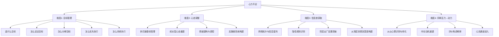

# 心力知识库：在信息爆炸时代投资自己

> **创建时间：** 2026-05-31
> **数据来源：** 百大认知书籍（62本）中精选21本，逐本提取精确原句
> **核心问题：** 在AI时代，你有很多优质知识和方法论，却没有心力去做——如何破解？

---

## 一、心力的定义

**心力 = 你愿意花时间精力和消耗情绪去做一件事情的资源。**

- **投资** = 在未来你会因为你现在做的这件事情而获得收益
- **消费** = 只是在短时间内获得一时的快感

短视频消耗注意力，AI取代人类焦虑导致的内耗，同辈压力——这些都是在消耗你的心力资本。

---

## 二、四维度拆解框架



### 维度之间的关系

| 维度 | 解决什么 | 核心一句话 |
|------|---------|----------|
| **目标管理** | "不知道该做哪个"（选择过载） | 用精要主义砍掉90%目标，用WOOP写入执行程序 |
| **心态调整** | "知道该做但恐惧/内耗"（情绪劫持） | 不是意志力问题，是神经化学问题——先恢复多巴胺基线，再行动 |
| **信息差获取** | "做了但方向不对"（信号vs噪声） | 信息差 = 网络位置 × 隐性规则理解 × 知识内化深度 × 注意力质量 |
| **同辈压力→动力** | "比较带来焦虑而非动力"（社会比较劫持） | 把"别人比我强"从生存威胁重构为信息性社会影响 |

---

## 三、核心洞察——为什么"知道但做不到"

> 「纯粹的积极幻想是对大脑的欺骗，它让系统误以为目标已经达成，从而剥夺了行动的生理能量。」——《WOOP思维心理学》

**根本原因不是懒，是三层系统同时故障：**

1. **多巴胺系统故障**（器层）：高频刺激（短视频）把多巴胺基线拉低，低刺激任务（学习）无法提供启动燃料
2. **情绪系统劫持**（心态层）：同辈压力+AI焦虑→杏仁核接管→前额叶算力泄漏→认知资源枯竭
3. **认知系统模糊**（目标层）：海量方法论+选择过载→潜意识因"模糊"而退缩→驱向最清晰的即时反馈（刷手机）

**解法：不是"更有意志力"，而是"重建系统"——恢复多巴胺基线 + 重构情绪标签 + 消除目标模糊 + 设计环境默认值。**

---

## 四、书籍索引

### 按维度分布

| 维度 | 书籍 | 引用状态 |
|------|------|---------|
| **目标管理** | 051 WOOP、013 精要主义、007 搞定GTD、015 吃掉那只青蛙、006 原子习惯 | 051/013/007/015 首次激活 |
| **心态调整** | 001 多巴胺国度、014 心态、011 认知觉醒、046 反脆弱、050 情绪、026 笛卡尔的错误 | 050/026 首次激活 |
| **信息差获取** | 037 结构洞、004 金榜题名之后、030 不平等的童年、009 认知天性、005 深度工作 | 037/030 首次激活 |
| **同辈压力→动力** | 039 社会动物、058 内在动机、053 家庭作业的迷思、012 心流、023 认知觉醒 | 058/053/012 首次激活 |

### 书籍引用统计

| 类型 | 数量 | 书目 |
|------|------|------|
| **首次激活（零引用→激活）** | 11本 | 051/013/007/015/050/026/037/030/058/053/012 |
| **交叉引用（已有引用）** | 10本 | 001/014/011/046/006/009/005/004/039/023 |
| **跨维度复用** | 4本 | 014(目标+心态)、023(心态+同辈)、001(目标+心态)、046(心态+目标) |

---

## 五、使用指南

### 遇到具体问题时

1. **"我今天该做什么？"** → 读 `01-目标管理.md` → 013精要主义的90%规则
2. **"我知道该做但就是不想动"** → 读 `02-心态调整.md` → 001多巴胺国度的自我绑定
3. **"信息太多不知道哪个适合我"** → 读 `03-信息差获取.md` → 004金榜题名之后的目标掌控者
4. **"看到别人比我强就焦虑"** → 读 `04-同辈压力转动力.md` → 058内在动机的动机内化光谱

### AI协作指令模板

```
"AI，我现在的心力状态是：[描述具体状态]
我需要解决的维度是：[目标管理/心态调整/信息差获取/同辈压力]
请用[书籍编号]中的[具体概念]帮我设计行动方案。"
```

---

> **版本：** v1.0
> **书籍总数：** 21本（去重后17本独立书目）
> **总概念数：** 91个核心概念+精确原句
> **下次更新：** 扩展到剩余41本零引用书籍的相关概念
