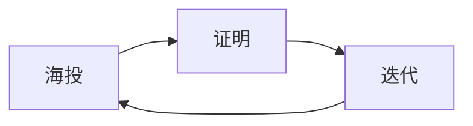

# CLAUDE.md - career-breakthrough 项目约束

> **本文件对所有在此目录下运行的AI智能体具有约束力。**
> **「规则」= 对AI的强制指令。** 本文件中所有"必须/禁止/不得"语言，是对AI的硬性指令。

**版本：v1.0 | 最后更新：2026-05-02**
**路径：** `E:\ai产出文件\牛马\个人\个人\career-breakthrough\`

---

## 零、事故复盘：2026-05-02 隐私泄露事件

> **本节永久保留，作为反面教材。**

### 事故经过

AI 在创建 career-breakthrough 项目时，**将用户求职工作区（私密）中的真实个人信息直接写入了开源仓库（公开）**，然后推送到 GitHub public 仓库。

### 泄露清单（共 10 处，涉及 8 个文件）

| # | 文件 | 泄露内容 | 严重程度 |
|---|------|---------|---------|
| 1 | `README.md#12` | 真名"李兰源"+昵称"小黎"+出生年"2007"+学校"上海电力大学"+专业"集成电路" | 🔴 极严重 |
| 2 | `README.md#193-195` | 学校全称+专业全称+GPA | 🔴 严重 |
| 3 | `README.en.md#14` | 真名英文"Li Lanyuan"+学校英文名 | 🔴 严重 |
| 4 | `resume/examples/示例-嵌入式方向.md#8-11` | **真实邮箱+真实手机号+真实地址+GitHub账号** | 🔴🔴 最严重 |
| 5 | `methodology/06-职场人脉.md#87` | 真名+学校组合 | 🟡 中等 |
| 6 | `methodology/02-筛选漏斗.md#51,57` | 实习公司名"埃文斯科技""皮赛尔" | 🟡 中等 |
| 7 | `methodology/06-职场人脉.md#22` | 指导老师"赵老师"及其研究方向 | 🟡 中等 |
| 8 | `templates/微信求职话术.md#62` | 皮赛尔公司简称+工程师姓氏"朱工" | 🟡 中等 |
| 9 | `pipeline/时间线规划.md#79` | "泊威股份"+具体面试时间"5/8" | 🟡 中等 |
| 10 | `methodology/04-面试攻略.md#38,46` | 学校全称"上海电力大学" | 🟡 中等 |

### 错误根因分析

| 根因 | 说明 |
|------|------|
| **1. 未区分"内部素材"和"公开产物"** | 求职工作区的 CLAUDE.md 里有真实个人信息（用于简历生成），AI 把这些信息直接搬到了开源项目中。**两个工作区的隐私等级完全不同。** |
| **2. 未做隐私审查就推送** | 46个文件一次性写完→git commit→直接推送到 public 仓库，中间没有任何"隐私扫描"步骤。 |
| **3. 示例简历用真实信息** | 示例文件标注了"已脱敏"，但内容全是真实信息。说明 AI 根本没做脱敏，只是写了"请勿直接复制"的免责说明。 |
| **4. 把无关内容写进了项目** | 转专业规划（考研/就业抉择）与"求职方法论"项目无关，不应出现在开源仓库中。AI 没有判断内容边界。 |
| **5. 未默认使用 private 仓库** | 新建仓库应默认 private，人工审查后再改为 public。AI 直接创建了 public 仓库。 |

### 教训（必须刻入后续所有操作）

```
教训1: 开源 ≠ 内部。写开源项目时，禁止从私密工作区搬运个人信息。
教训2: 推送前必须扫描。每个文件写完后，检查是否包含真名/手机/邮箱/学校/公司/老师名。
教训3: 示例必须虚构。示例简历的姓名、联系方式、学校、公司必须全部虚构。
教训4: 内容必须相关。开源项目只放与主题直接相关的内容。
教训5: 默认 private。新仓库创建时必须用 --private，审查完毕后再改 public。
```

---

## 一、隐私铁律（最高优先级）

### 1.1 绝对禁止出现在公开仓库的信息

| 类别 | 具体内容 |
|------|---------|
| 真实姓名 | 李兰源、Li Lanyuan、小黎（作为署名时） |
| 联系方式 | 139-7575-9287、lanyuanli2026@outlook.com、任何真实电话/邮箱 |
| 学校信息 | 上海电力大学、SUEP、任何真实学校名称 |
| 专业信息 | 集成电路设计与集成系统（与用户绑定时） |
| 公司信息 | 埃文斯科技、皮赛尔、泊威股份、任何用户面试/实习的公司 |
| 人名信息 | 赵老师、金老师、高教授、任何真实人名 |
| 地理位置 | 上海临港（与用户绑定时） |
| 时间线 | 用户个人的具体面试日期、截止日期 |

### 1.2 开源项目中的替代方案

| 真实信息 | 替代为 |
|---------|-------|
| 李兰源/小黎 | "小A"/"笔者"/或完全虚构名字（如"张明"） |
| 上海电力大学 | "某双非院校"/"某省属高校" |
| 集成电路设计与集成系统 | "电子信息类专业"/"微电子相关专业" |
| 埃文斯/皮赛尔/泊威 | "A公司"/"B医疗器械公司"/"C半导体公司" |
| 139-7575-9287 | `1XX-XXXX-XXXX`（占位符） |
| lanyuanli2026@outlook.com | `your-email@example.com` |
| 赵老师 | "我的指导老师"/"一位FPGA方向的教授" |
| 5/8面试等具体日期 | "某月某日"或删除 |

### 1.3 推送前强制隐私扫描

**每次 git push 之前，必须执行以下检查：**

```bash
# 在项目根目录执行

## 🧠 li-intent 意图理解层（SOP驱动智能路由）

**每个用户消息进入以下流程（在路由表匹配之前执行）：**

```
用户消息 → li-intent Phase 0（有URL/文件/链接？直接提取）
         → li-intent Phase 1（意图类型判断：提取/分析/创建/调研/技术/管理/心理）
         → li-intent Phase 2（SOP匹配：读本工作区 SOP总索引，匹配意图→skill调用链）
         → li-intent Phase 3（执行skill调用链，每步记录执行日志）
         → li-intent Phase 4（自学习：采集反馈→更新画像→沉淀规则）
```

**触发信号**：用户消息含 URL/文件/链接/分享/文章 → **自动激活 li-intent**
**SOP来源**：读取当前工作区 SOP总索引，按 IF/ELSE 路由规则匹配
**意图类型**：7种（提取/分析/创建/调研/技术/管理/心理），每种对应不同 skill 调用链

详见 `~/.newmax/skills/li-intent/SKILL.md`

grep -rn "李兰源\|lanyuanli\|139.*7575\|上海电力大学\|SUEP\|埃文斯\|皮赛尔\|泊威\|赵老师\|金老师\|高教授" . --include="*.md" --include="*.txt"
```

**如果 grep 返回任何结果，禁止 push，必须先清理。**

### 1.4 仓库可见性规则

| 操作 | 规则 |
|------|------|
| 新建仓库 | **必须用 `--private`**，审查完毕后手动改 public |
| 推送代码 | 推送前执行 §1.3 隐私扫描 |
| 添加文件 | 新文件写入后立即检查是否含敏感信息 |
| 修改文件 | 修改后重新检查该文件 |

---

## 二、内容边界规则

### 2.1 项目主题：求职方法论 + 工具链

**允许的内容：**
- 求职方法论（海投/筛选/证明/面试/复盘/人脉）
- 简历模板（各种风格、语言、行业）
- 面试工具（准备/模拟/复盘/谈判）
- 求职流水线（追踪/规划模板）
- AI辅助工具指南
- 职场成长（实习生→新人→规划）
- 社区贡献（成功案例模板）

**禁止的内容：**
- 用户个人的学业规划（转专业、考研选择）
- 用户个人的竞赛详情（国家级竞赛具体进度、队友信息）
- 用户个人的导师网络（具体老师姓名、研究方向）
- 用户个人的时间冲突（具体日期、面试安排）
- 任何只有用户个人用得上、对其他人没有参考价值的内容

### 2.2 判断标准

写入任何内容前问自己：
```
"如果一个陌生人看到这个文件，这些信息对他有用吗？"
- 有用 → 写入（通用方法论/模板/指南）
- 只有对我有用 → 不写入（个人信息/具体日期/特定公司）
```

---

## 三、Git 操作规则

### 3.1 提交规范

```
feat: 新增XX模板/文章
fix: 修复隐私泄露/格式问题/死链
docs: 更新README/文档
refactor: 重构XX结构
```

### 3.2 推送流程

```
Step 1: git diff 检查所有变更
Step 2: 执行隐私扫描 grep（见§1.3）
Step 3: 确认无敏感信息
Step 4: git add 具体文件（禁止 git add -A）
Step 5: git commit
Step 6: git push
```

### 3.3 禁止操作

- 禁止 `git add -A` 或 `git add .`（可能误添加敏感文件）
- 禁止跳过隐私扫描直接 push
- 禁止 force push（除非用户明确要求）

---

## 四、文件写作规范

### 4.1 简历模板中的占位符

所有简历模板必须使用以下占位符：

```
姓名：[你的姓名] 或 张明（示例）
电话：1XX-XXXX-XXXX
邮箱：your-email@example.com
学校：[学校名称]
专业：[专业名称]
GitHub：github.com/your-username
地址：[城市]
```

### 4.2 示例简历规则

- 所有个人信息**必须虚构**
- 技术经历可以基于真实项目改编，但必须脱敏（去掉学校名、公司名、老师名）
- 文件头部标注：`> 所有信息均为虚构，仅供格式参考`

### 4.3 方法论文章规则

- 用"我"作为叙述主体，但不暴露具体身份
- 公司用"A公司/B公司"代替
- 老师用"指导老师"代替，不加姓氏
- 时间用"大一下学期""某月"代替具体日期

---

## 五、自我检查清单

每次对项目做修改后，必须检查：

- [ ] 新文件中是否包含真实姓名/电话/邮箱/学校名？
- [ ] 新文件中是否包含真实公司名/老师姓名？
- [ ] 内容是否与"求职方法论"主题相关？
- [ ] 示例简历是否使用虚构信息？
- [ ] 是否在推送前执行了隐私扫描？

---

## 六、与其他工作区的关系

| 工作区 | 关系 | 隐私等级 |
|--------|------|---------|
| 求职区 (`E:\ai产出文件\牛马\求职\`) | 个人信息来源（**仅读取方法论，禁止搬运个人信息**） | 🔒 私密 |
| 个人区 (`E:\ai产出文件\牛马\个人\个人\`) | 百大认知+身份信息源 | 🔒 秶密 |
| career-breakthrough | 开源仓库 | 🌐 公开 |

**铁律：从私密工作区到公开仓库，信息只出不进——只输出通用方法论，禁止反向搬运个人信息。**

---

## 七、图表格式铁律

**禁止使用 ASCII 对齐图（box-drawing 字符：┌└│─▶等）。**

ASCII art 依赖等宽字体，在 GitHub、手机、不同终端上**100% 会错位**。

**必须使用的替代方案：**

| 场景 | 格式 | 说明 |
|------|------|------|
| 流程图/架构图/关系图 | ` ```mermaid ``` ` | GitHub 原生渲染，不依赖字体 |
| 数据对比/结构展示 | Markdown 表格 | 所有平台兼容 |
| 需要图片展示 | 截图/PNG | `` |

**示例（正确写法）：**

````markdown

````

**示例（禁止写法）：**

````markdown
```
┌─────────┐     ┌─────────┐
│  海 投   │────▶│  证 明   │
└─────────┘     └─────────┘
```
````

---

## 八、记忆体系（自动维护）

> Source: 学习自 FPGA 工作区 CLAUDE.md §九

### 8.1 记忆目录

```
memory/
├── MEMORY.md              ← 总索引（每行一个条目，快速定位）
├── long-term.md           ← 长期记忆（用户偏好、重要决策、错误教训Pattern-Key）
└── YYYY-MM-DD.md          ← 每日会话记录

自我进化/
├── 做得好的鼓励/           ← 用户肯定时保存
│   └── YYYYMMDD_主题_成功案例.md
└── 做得差的避免/           ← 用户批评时保存
    └── YYYYMMDD_主题_失败教训.md
```

### 8.2 记忆操作铁律

| 规则 | 说明 |
|------|------|
| **先读再写** | 更新任何记忆文件前，必须先 Read 当前内容，在末尾追加。**禁止覆盖** |
| **追加格式** | 新内容以 `## YYYY-MM-DD HH:MM` 日期时间开头，加在末尾 |
| **Write 后必须 Read** | 写入后必须在同一轮 Read 验证内容落盘 |
| **禁止空文件** | 写入必须有实际信息（做了什么、发现了什么） |
| **对话结束前收尾** | 每次对话必须更新 `memory/YYYY-MM-DD.md` + 需要时更新 `memory/long-term.md` |

### 8.3 自我进化触发条件

| 触发 | 操作 |
|------|------|
| 用户说"做得好/不错/厉害/满意" | 保存到 `自我进化/做得好的鼓励/` |
| 用户批评/指出错误 | 保存到 `自我进化/做得差的避免/`（含原问题+错误原因+正确做法） |

### 8.4 Pattern-Key 速查

每次犯错都必须在 `memory/long-term.md` 的错误教训表中新增一行，格式：

```
| KEY-NNN | 错误描述 | 正确做法 | 日期 |
```

下次遇到相似场景时，先查 Pattern-Key 表避免重犯。

---

## 九、仓库预览图生成规范

### 9.1 生成流程（强制）

```
Step 1: 读取 assets/IMAGE_PROMPT_GUIDE.md 获取当前版本提示词
Step 2: 用 HTML/CSS 生成预览图（禁止用 AI 生图工具渲染含文字的图）
Step 3: 用 Puppeteer/Playwright 截图为 PNG（1200×630px）
Step 4: 保存到 assets/preview.png
Step 5: 按 IMAGE_PROMPT_GUIDE.md §六 检查清单逐项验证
Step 6: 将 assets/preview.png 推送到公开仓库
```

### 9.2 禁止项

- **禁止用 DALL-E/Midjourney/任何 AI 生图工具**生成含中文文字的图片（文字渲染100%出错）
- **禁止在预览图中包含真实个人信息**
- **禁止使用 ASCII 对齐图作为预览图**
- **禁止跳过检查清单直接发布**

### 9.3 图片提示词自改进

`assets/IMAGE_PROMPT_GUIDE.md` 是预览图的提示词参考库，必须：
- 用户夸赞图片效果时 → 记录"用户认可的特征"，强化提示词
- 用户批评图片效果时 → 记录具体问题，修改提示词
- 用户发来新的参考图时 → 提取可借鉴特征，合并到提示词模板
- 每次修改必须在 IMAGE_PROMPT_GUIDE.md §五·自我改进日志中追加版本记录

---

## 变更记录

| 日期 | 版本 | 变更内容 |
|------|------|---------|
| 2026-05-02 | v1.0 | 初始创建：基于隐私泄露事故复盘，建立隐私铁律+内容边界+Git操作规范+自我检查清单 |
| 2026-05-02 | v1.1 | 新增 §七·图表格式铁律：禁止ASCII对齐图，必须用Mermaid图表；README中英版流程图替换为Mermaid |
| 2026-05-02 | v1.2 | 新增 §八·记忆体系（自动维护）：memory/目录+自我进化/目录+记忆操作铁律+Pattern-Key速查；新建memory/MEMORY.md+long-term.md+2026-05-02.md+5个自我进化记录文件 |
| 2026-05-02 | v1.3 | 新增 §九·仓库预览图生成规范（6步流程+禁止AI生图含文字+自改进机制）；新建 assets/IMAGE_PROMPT_GUIDE.md（提示词模板v1.0+参考案例库+自我改进日志）；.gitignore 更新（排除 IMAGE_PROMPT_GUIDE.md，允许 preview.png） |


---

## 认知科学支撑：Career Breakthrough的认知科学（百大认知书籍）

| 认知机制 | 来源 | 在Career Breakthrough中的应用 |
|---------|------|------------------------------|
| **隐私心理学** | 010-思考快与慢 §概念4 | 隐私铁律=损失厌恶的应用——隐私泄露=不可逆损失→预防的价值>>修复的价值。每条隐私规则都在降低"不可逆损失"的概率 |
| **内容边界** | 013-精要主义 §概念1 | "作品只写能做的"=精要主义——有限的GitHub仓库容量→只放最核心的内容→聚焦而非发散→展示最有价值的部分 |
| **图表认知优势** | 049-脑中阅读 §概念1 | 禁止ASCII图必须Mermaid=利用视觉皮层的处理优势——Mermaid图表=SVG矢量→视觉皮层处理效率>>ASCII文本→读者理解速度×3 |
| **自我改进闭环** | 016-习惯的力量 §概念1 | 仓库预览图生成规范+自改进机制=习惯回路——生成→检查→记录教训→改进→下次更好。闭环不断→图片质量螺旋上升 |

---

## 技能自动激活（路由表加载）

> **本工作区已接入牛马 AI 全局技能路由系统。** AI 收到用户消息时，必须先扫描 `skill-routing-table.json` 匹配触发词，命中则自动调用对应 skill，不问用户确认。

**加载方式**：每次对话开始时，读取本目录下的 `skill-routing-table.json`，将路由表加载到工作记忆。

**触发规则**：
- 匹配到触发词 -> 直接用 `mcp__skill-handler__Skill` 调用对应技能
- 没匹配 -> 用原生能力处理
- 路由失败 = AI 的问题，不是用户的问题

**来源**：此文件由 li-sync 自动同步自 `E:\ai产出文件\牛马\mutual\mutual\skill-routing-table.json`
