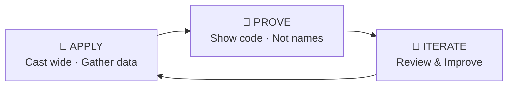

# 🚀 Career Breakthrough

> **A freshman's job-hunting playbook + complete toolkit. No elite school brand — let your projects speak.**

[中文版](README.md) | English

---

## My Story

I'm a freshman at a non-elite university in China (what we call "双非" — not a 985/211 school), majoring in Electronic Information.

In spring 2026, I started looking for internships. No prestigious school name, no alumni network, no industry connections.

**My approach was simple: mass apply broadly → prove my skills with real projects → iterate after every interview.**

In three weeks, I applied to 20+ companies, got 3-4 interviews, and landed 2 internship offers (including an FPGA Application Engineer role).

After I shared my offer on WeChat Moments, many friends asked: "How did you do it?"

This project is my answer.

---

## What's In This Project

Whether you're a freshman or a mid-career professional, there's something here for you:

- **Methodology** — 6 articles on the complete job-hunting loop (from real experience)
- **Resume Templates** — 12 templates: Chinese + English, student + professional, Markdown + printable
- **Interview Toolkit** — prep checklists, HR question simulation, review templates, salary negotiation
- **AI-Powered Workflow** — practical guides for using Claude Code / Gemini in your job search
- **Pipeline Management** — company tracking, timeline planning, application status management
- **Career Growth** — intern survival guide, new grad handbook, career planning framework

---

## Core Philosophy: Apply → Prove → Iterate

1. **Apply** — Mass application isn't reckless; it's systematic market research. Every application teaches you what the market wants.
2. **Prove** — Let code, waveforms, and project documentation speak for you. Not your school's ranking.
3. **Iterate** — Every interview is free market research. Review → update resume → stronger next time.

> **Context for international readers:** In China, university prestige plays a huge role in hiring. Schools are categorized as "985" (top ~39), "211" (top ~116), or "双非" (everything else). Many large companies auto-filter non-985/211 resumes. This toolkit is designed to help students break through that barrier with skills and projects.

---

## Quick Start

### 🎓 Students Looking for Internships

1. Read [`methodology/01-海投心法.md`](methodology/01-海投心法.md) (Mass Application Mindset)
2. Pick a template from [`resume/templates/en/`](resume/templates/en/) and follow the [STAR Guide](resume/ai-generation-guide/STAR法则.md)
3. Track applications with [`pipeline/企业追踪模板.md`](pipeline/企业追踪模板.md)
4. Prep with [`interview/面试准备清单.md`](interview/面试准备清单.md)
5. Review after each interview with [`interview/面试复盘模板.md`](interview/面试复盘模板.md)

### 💼 Career Changers / Experienced Professionals

1. Read [`methodology/03-证明自己.md`](methodology/03-证明自己.md) (Prove Yourself)
2. Use [`resume/templates/en/professional-senior.md`](resume/templates/en/professional-senior.md)
3. Read [`career-growth/薪资谈判指南.md`](career-growth/薪资谈判指南.md)

### 🤖 AI-Powered Workflow

1. Read [`ai-tools/AI辅助简历写作.md`](ai-tools/AI辅助简历写作.md) — AI draft → human edit → iterate
2. Use [`ai-tools/AI面试模拟.md`](ai-tools/AI面试模拟.md) for mock interviews
3. Follow [`resume/ai-generation-guide/去AI味指南.md`](resume/ai-generation-guide/去AI味指南.md) to keep your resume human

---

## Resume Templates

### English Templates

| Template | Use Case | File |
|----------|----------|------|
| Student Intern · Minimal | Clean & simple layout | [`en/student-intern-minimal.md`](resume/templates/en/student-intern-minimal.md) |
| Student Intern · Technical | Technical roles (SWE/EE/FPGA) | [`en/student-intern-technical.md`](resume/templates/en/student-intern-technical.md) |
| Professional · Junior | 1-3 years experience | [`en/professional-junior.md`](resume/templates/en/professional-junior.md) |
| Professional · Senior | 3-5+ years, leadership roles | [`en/professional-senior.md`](resume/templates/en/professional-senior.md) |

### Chinese Templates (中文模板)

| 模板 | 适用场景 | 文件 |
|------|---------|------|
| 学生实习·简洁版 | 中小企业实习 | [`cn/学生实习版-简洁.md`](resume/templates/cn/学生实习版-简洁.md) |
| 学生实习·技术版 | FPGA/嵌入式/软件 | [`cn/学生实习版-技术深度.md`](resume/templates/cn/学生实习版-技术深度.md) |
| 职场初级版 | 1-3年跳槽 | [`cn/职场初级版.md`](resume/templates/cn/职场初级版.md) |
| 职场进阶版 | 3-5年高级岗 | [`cn/职场进阶版.md`](resume/templates/cn/职场进阶版.md) |

### Markdown Templates (GitHub / Online)

| Template | File |
|----------|------|
| CN · Simple | [`markdown/cn/简洁版.md`](resume/templates/markdown/cn/简洁版.md) |
| CN · Technical | [`markdown/cn/技术深度版.md`](resume/templates/markdown/cn/技术深度版.md) |
| EN · Minimal | [`markdown/en/minimal.md`](resume/templates/markdown/en/minimal.md) |
| EN · Technical | [`markdown/en/technical.md`](resume/templates/markdown/en/technical.md) |

---

## My Real Data

| Metric | Data |
|--------|------|
| School | A non-985/211 university in China |
| Year | Freshman |
| Major | Electronic Information |
| GPA | 3.8+/4.0 |
| Applications | 20+ |
| Interviews | 3-4 |
| Offers | 2 |
| Time spent | ~3 weeks |
| Edge | Hand-written FPGA RTL (no IP cores) + AI-assisted development |

---

## Contributing

PRs welcome! See [CONTRIBUTING.md](CONTRIBUTING.md).

---

## Acknowledgments

This project was inspired by [santifer/career-ops](https://github.com/santifer/career-ops) — Santiago built an AI-powered job search system that evaluated 740+ positions and helped land a Head of Applied AI role. His work showed that job-seeking can be systematized, not just luck. If you're an experienced professional, go check out his project.

Career Breakthrough adapts this philosophy for a different audience: **college students and early-career job seekers** who face the same challenge with fewer resources.

Thanks to Santiago for open-sourcing his work and proving that great tools should be free.

---

## License

MIT — use freely, please keep attribution.
