# 规则体系索引（Rules Index）

> 创建日期：2026-05-27
> 来源：规则体系优化——建立规则地图，一个入口读完全局
> 用途：新对话的 AI 只需要读这一个文件就能知道整个规则体系的结构

---

## 一、规则地图（可视化）

```mermaid
graph TD
    ROOT["📄 CLAUDE.md<br/>每次对话必读"]

    %% ===== 启动序列 =====
    SEQ["🚀 启动序列<br/>Step 0→6"]
    ROOT --> SEQ
    SEQ --> S0["Step 0<br/>runtime-snapshot.md"]
    SEQ --> S1["Step 1<br/>memory/long-term.md"]
    SEQ --> S2["Step 2<br/>memory/today.md"]
    SEQ --> S3["Step 3<br/>evolution-calendar.md<br/>+ lessons.md 最近5条"]
    SEQ --> S6["Step 6 ⏰ 对话结束前<br/>教训沉淀 checklist 回顾"]

    %% ===== F1-F7 铁律（按领域聚类） =====
    subgraph IRON["⚔️ 铁律层 F1-F7（嵌入 CLAUDE.md，不可跳过）"]
        direction TB

        subgraph DOMAIN_OUTPUT["📤 输出质量"]
            F1["F1 技能审计<br/>对话结束前输出审计"]
            F5["F5 中文标点<br/>禁止英文引号/标点"]
            F8["F8 内容创作路由<br/>不读SOP不动笔"]
        end

        subgraph DOMAIN_FILE["📁 文件与记忆"]
            F2["F2 文件操作<br/>先读→写→读验证"]
            F3["F3 记忆归档<br/>.newmax 路径唯一"]
            F4["F4 双归档<br/>删前双份归档"]
        end

        subgraph DOMAIN_GROWTH["🔄 成长与学习"]
            F6["F6 教训回写<br/>四步闭环"]
            F7["F7 品读闭环<br/>公众号四步"]
        end
    end

    ROOT --> IRON

    %% ===== 补充规则（挂在铁律下面） =====
    subgraph RULES["📋 补充规则（.claude/rules/）"]
        direction TB

        subgraph GRP_ENG["🔧 工程方法论"]
            LAW["10-engineering-laws.md<br/>🔴 最高 · 10条法则"]
            LIFE["lifecycle-sop.md<br/>🔴 高 · 六阶段生命周期"]
            VER["verification-and-archival-rules.md<br/>🔴 高 · 防假象+负结果+边界"]
            THIN["think-before-act.md<br/>🟡 中 · 动手前三步"]
        end

        subgraph GRP_SEC["🔒 安全防护"]
            SCRIPT["script-safety-check.md<br/>🔴 高 · 脚本安全"]
            PS["powershell-safety.md<br/>🔴 高 · PS执行安全"]
            PRIV["privacy-sanitization.md<br/>🔴 最高 · 隐私脱敏"]
            MCP["mcp-config-protocol.md<br/>🔴 高 · MCP配置"]
            FEISHU["feishu-api-protocol.md<br/>🔴 最高 · 飞书API"]
        end

        subgraph GRP_MEM["🧠 记忆与身份"]
            ID["identity-and-preference.md<br/>🟡 中 · 身份+偏好"]
            CAND["memory-candidate-protocol.md<br/>🟡 中 · 记忆候选"]
            CONF["memory-confidence.md<br/>🟢 低 · 置信度"]
        end

        subgraph GRP_COMM["💬 沟通输出"]
            OVER["anti-info-overload.md<br/>🟡 中 · 防过载"]
        end

        subgraph GRP_DEFENSE["🛡️ 防御"]
            NOROOT["no-root-rules-dir.md<br/>🟡 中 · 禁建rules/"]
        end

        subgraph GRP_LESSON["📝 教训沉淀"]
            SINK["lesson-sink-checklist.md<br/>🔴 高 · 四步checklist"]
        end

        subgraph GRP_GIT["🔄 Git与同步"]
            GIT["git-auto-sync.md<br/>🔴 高 · 三层防护+远程"]
        end
    end

    %% ===== 铁律 → 补充规则的展开关系 =====
    F2 -->|"展开脚本安全"| SCRIPT
    SCRIPT -->|"PowerShell特化"| PS
    F3 -->|"记忆候选机制"| CAND
    F3 -->|"置信度协议"| CONF
    F4 -->|"远程同步维度"| GIT
    F6 -->|"可执行checklist"| SINK
    S6 -.->|"引用"| SINK

    %% ===== 工程方法论内部关系 =====
    LAW -->|"法则2/7/8展开"| VER
    LAW -.->|"时间轴vs横轴"| LIFE
    THIN -.->|"法则3互补"| LAW

    %% ===== 独立规则 =====
    PRIV -.->|"推送前必过"| F4
    MCP -.->|"配置时触发"| F2

    %% ===== 样式 =====
    classDef root fill:#1a1a2e,stroke:#e94560,stroke-width:3px,color:#fff
    classDef iron fill:#16213e,stroke:#0f3460,stroke-width:2px,color:#fff
    classDef seq fill:#533483,stroke:#e94560,stroke-width:1px,color:#fff
    classDef ruleHigh fill:#b91c1c,stroke:#ef4444,color:#fff
    classDef ruleMid fill:#a16207,stroke:#eab308,color:#000
    classDef ruleLow fill:#15803d,stroke:#22c55e,color:#fff
    classDef ruleDef fill:#1e3a5f,stroke:#3b82f6,color:#fff

    class ROOT root
    class F1,F2,F3,F4,F5,F6,F7 iron
    class S0,S1,S2,S3,S6 seq
    class LAW,LIFE,VER,SCRIPT,PS,PRIV,MCP,FEISHU,GIT,SINK ruleHigh
    class THIN,ID,CAND,OVER,NOROOT ruleMid
    class CONF ruleLow
```



### 图例说明

| 线型 | 含义 |
|------|------|
| 实线箭头 `→` | 展开关系（A 是 B 的详细版本） |
| 虚线箭头 `-.->` | 互补关系（A 和 B 互相补充） |
| 红色节点 | 🔴 最高/高优先级 |
| 黄色节点 | 🟡 中优先级 |
| 绿色节点 | 🟢 低优先级 |

### 快速查找指南

**"我要做 X，该读哪个文件？"**

| 场景 | 直接读 | 铁律 |
|------|--------|------|
| 写代码/脚本 | `script-safety-check.md` → `powershell-safety.md` | F2 |
| 删除文件 | `git-auto-sync.md` | F4 |
| 验证数字/交付 | `verification-and-archival-rules.md` | — |
| 推送到公开仓库 | `privacy-sanitization.md` | F4 |
| 记录教训 | `lesson-sink-checklist.md` | F6 |
| 修改 MCP 配置 | `mcp-config-protocol.md` | — |
| 新项目启动 | `lifecycle-sop.md` + `10-engineering-laws.md` | — |
| 被用户纠正 | `lesson-sink-checklist.md`（四步闭环） | F6 |
| 输出太长/太详细 | `anti-info-overload.md` | — |
| 内容创作/朋友圈/公众号/小红书/海报 | 路由表 → 对应子模块 CLAUDE + 品牌档案 | **F8** |
| 飞书 API / 飞书脚本 / 上传飞书 | `feishu-api-protocol.md` | — |
| **创建新文件 / 写文件** | `file-placement-precheck.md`（写前判断：持续性参考→子模块 vs 一次性交付→outputs） | F2 |
| **txt转md / 嘉宾笔记 / 整理分享 / 看到人名判断归属** | `see-name-stop.md`（见名即停三步判断）→ `SOPs/19_txt-md笔记转换标准工作流.md`（六步标准工作流） | **见名即停铁律** |

---

### 核心规则（CLAUDE.md 铁律 F1-F7）

| 铁律 | 核心要求 | 违规检测信号 |
|------|----------|-------------|
| **F1 技能审计** | 对话结束前输出技能审计格式 | 对话结束时没有输出 `📋 技能审计`；"被忽视的"一栏为空 |
| **F2 文件操作** | 禁止伪造、Write 后 Read、先 Read 再 Write | Write/Edit 后没有 Read 验证；说"已写入"但没有 tool_use；修改前没 Read |
| **F3 记忆归档** | 禁止写项目沙箱 memory/，用 .newmax 绝对路径 | 用 write_project_file 写沙箱 memory/；有重要发现没写当日记忆；直接写 MEMORY.md |
| **F4 双归档** | 删除前必须双归档（全局+工作区） | 删除文件前没归档；只归档了一份；删除后没输出归档报告 |
| **F5 中文标点** | 禁止英文引号/单引号，写作前必读 SOP | 输出中出现英文引号/单引号；写作前没读 SOP 总索引 |
| **F6 教训回写** | 教训必须回写 Skill/SOP（四步闭环） | 只写 memory 没写 negative-results；没更新 self-evolution；同类教训≥2次没升级规则 |
| **F7 品读闭环** | 公众号链接+标注词→四步闭环 | 收到链接+标注词但没完成四步；只做①②不做③④；提到仓库/论文没下载 |
| **F8 内容创作路由** | 内容创作需求必须先走路由表读SOP/品牌档案 | 没走路由表就动笔；产出风格与用户真实文风不一致；没读品牌档案就写；写完没走自审 |

### 补充规则文件（.claude/rules/）

| 文件 | 核心内容 | 触发条件 | 优先级 | 与其他规则的关系 |
|------|----------|----------|--------|-----------------|
| `10-engineering-laws.md` | 10条工程法则（证据分层、防假象、实测优先、工具自由度、跨边界校验、隔离契约、负结果归档、门禁文化、识别结构墙、规则结晶） | 所有工程/验证任务 | 🔴 最高 | 是 verification-and-archival-rules.md 的底层方法论 |
| `verification-and-archival-rules.md` | 防假象审计（五连问）+ 负结果归档（格式+流程）+ 边界声明（三栏清单） | 任何涉及数字验证、方案失败、交付物的场景 | 🔴 高 | 展开 10-engineering-laws.md 的法则 2/7/8 |
| `lifecycle-sop.md` | 项目生命周期六阶段（立项→探索→并行→签核→复盘→交付） | 新项目启动、阶段流转 | 🔴 高 | 与 10-engineering-laws.md 互补（时间轴 vs 横轴） |
| `identity-and-preference.md` | 身份一致性（四个维度）+ 偏好记忆（五种类型+记录格式） | 每次对话开始、用户表达偏好/纠正时 | 🟡 中 | 展开 CLAUDE.md § 用户偏好 |
| `lesson-sink-checklist.md` | 教训沉淀四步闭环（memory→negative-results→self-evolution→SOP） | 用户纠正、方案失败、踩坑时 | 🔴 高 | 展开 CLAUDE.md F6 铁律 |
| `anti-info-overload.md` | 防信息过载（五个信号+五个技巧） | 任何输出场景 | 🟡 中 | 与 CLAUDE.md § 响应结构优化 互补 |
| `think-before-act.md` | 动手前必先思考（决策门三步） | 非平凡任务开始前 | 🟡 中 | 与 10-engineering-laws.md 法则 3（实测优先）互补 |
| `script-safety-check.md` | 脚本安全检查（路径安全、操作范围、dry-run、不可逆确认、提权检查） | 任何脚本执行前 | 🔴 高 | 展开 CLAUDE.md F2（文件操作铁律）的脚本安全维度 |
| `powershell-safety.md` | PowerShell 执行安全（禁止 $_ 在 inline 模式） | 使用 PowerShell 时 | 🔴 高 | 展开 script-safety-check.md 的 PowerShell 特化 |
| `mcp-config-protocol.md` | MCP 配置协议（路径、命令格式、验证） | 修改 MCP 配置时 | 🔴 高 | 独立规则 |
| `privacy-sanitization.md` | 隐私脱敏（扫描清单、替换规则、事故响应） | 文件进入公开仓库前 | 🔴 最高 | 独立规则 |
| `git-auto-sync.md` | Git 自动同步（三层防护、远程备份） | 文件删除、远程推送时 | 🔴 高 | 展开 CLAUDE.md F4（双归档铁律）的远程同步维度 |
| `memory-candidate-protocol.md` | 记忆沉淀候选机制（用户确认后才写入） | 写入 memory/ 前 | 🟡 中 | 展开 CLAUDE.md F3 + Step 5 |
| `memory-confidence.md` | 记忆置信度与失效条件 | 写入长期记忆时 | 🟢 低 | 展开 CLAUDE.md F3 |
| `no-root-rules-dir.md` | 禁止创建根目录 rules/ | 任何目录创建操作 | 🟡 中 | 防御性规则 |
| `feishu-api-protocol.md` | 飞书 API 使用协议（禁止调用链接分享/协作者管理 API，App 只能创建+写入，权限交给用户 UI 操作） | 任何飞书 API 脚本编写/执行时 | 🔴 最高 | 与 script-safety-check.md 互补（脚本安全 vs API 安全） |
| `file-placement-precheck.md` | 文件放置写前检查（两个判断：持续性参考 vs 一次性交付物 + 是否已有同类文件） | 任何 Write / write_project_file 操作前 | 🔴 高 | 展开 CLAUDE.md F2（文件操作铁律）的"写前判断"维度 |
| `see-name-stop.md` | **见名即停**（三步判断：语法角色→交叉验证→反证搜索，10本百大认知根因分析） | 文本中出现人名且需要判断归属时（txt转md/嘉宾笔记/整理分享） | 🔴 最高 | 配合 SOP-19（txt→md标准工作流）；展开教训029（跨人物污染第三次触发→≥3次升级铁律）；与 lesson-sink-checklist 互补（教训记录 vs 主动拦截） |

---

## 二、违规检测信号汇总（详见 CLAUDE.md 铁律层）

> 以下信号直接嵌入 CLAUDE.md 铁律层，每次对话结束前自检。任一触发 → 停下来补。

### F1 技能审计
- [ ] 对话结束时没有输出 `📋 技能审计` 格式
- [ ] 技能审计中"被忽视的"一栏为空——说明没认真检查是否有遗漏

### F2 文件操作
- [ ] 本轮有 Write/Edit 操作但没有对应的 Read 验证记录
- [ ] 回复中说"已写入/已创建/已修改"但没有 tool_use 记录（伪造）
- [ ] 修改文件前没有先 Read 当前内容（盲写）

### F3 记忆归档
- [ ] 本轮用 write_project_file 写入了项目沙箱 memory/
- [ ] 本轮有重要发现/决策/教训但没写入当日记忆
- [ ] 直接写入了 MEMORY.md（应由 longmemory 技能归档）

### F4 双归档
- [ ] 本轮删除了文件但没有先归档到两个位置
- [ ] 只归档了一份（全局或工作区，不是两份都归档）
- [ ] 删除后没有输出归档报告

### F5 中文标点
- [ ] 本轮中文输出中出现英文引号 `""` 或英文单引号 `''`
- [ ] 本轮中文输出中出现 `...`（应为 `……`）或 `--`（应为 `——`）
- [ ] 写作任务开始前没读 SOP 总索引

### F6 教训回写
- [ ] 本轮有用户纠正/方案失败/踩坑，但只写了 memory，没写 negative-results
- [ ] 本轮有用户纠正/方案失败/踩坑，但没更新 self-evolution/lessons.md（🔴 最常遗漏）
- [ ] 同类教训已出现 ≥2 次但没升级为规则/SOP 迭代日志

### F7 品读闭环
- [ ] 收到公众号链接+标注词但没完成四步闭环
- [ ] 只做了①②（提取+下载），没做③④（融入+指引）
- [ ] 文中提到 GitHub 仓库/论文 PDF 但没下载到 downloads/

### F8 内容创作路由
- [ ] 收到内容创作需求但没走路由表就动笔
- [ ] 产出的内容风格与用户真实文风不一致（营销号腔、AI腔、鸡汤腔）
- [ ] 没读品牌档案/文风DNA就开始写
- [ ] 写完没走自审流程

---

## 三、规则健康度检查机制

### 每月盘点（每月最后一个工作日）

**检查内容**：
1. **触发频率**：每条规则最后一次被触发是什么时候？
   - 超过 30 天未触发 → 标记为 `[需刷新]`
   - 超过 90 天未触发 → 评估是否需要删除或合并

2. **矛盾检测**：有没有和其他规则矛盾？
   - 检查规则之间的引用关系
   - 检查是否有重复内容

3. **教训验证**：有没有被新的教训证明是错的？
   - 检查 self-evolution/lessons.md 中的最新教训
   - 检查是否有规则需要更新

4. **文件数量**：规则文件总数是否合理？
   - 目标：15 个以内
   - 如果超过 18 个 → 评估是否有合并空间

### 盘点模板

```markdown
## 规则健康度盘点 [YYYY-MM-DD]

### 文件数量
- 当前：[X] 个
- 目标：≤15 个
- 状态：[正常/需优化]

### 触发频率检查
| 规则 | 最后触发 | 状态 |
|------|----------|------|
| [规则1] | [日期] | [正常/需刷新/需删除] |
| ... | ... | ... |

### 矛盾检测
- [发现的矛盾或重复]

### 教训验证
- [需要更新的规则]

### 建议操作
- [合并/删除/更新/新增]
```

### 自动提醒

在 `self-evolution/evolution-calendar.md` 中添加每月盘点任务：
```markdown
| YYYY-MM-DD | ⏳ | 规则健康度月度盘点 | 小改 |
```

---

## 四、规则体系维护指南

### 新增规则

1. **先检查是否已有覆盖**：读本文件，确认没有重复
2. **确定优先级**：🔴 最高 / 🔴 高 / 🟡 中 / 🟢 低
3. **写入文件**：创建 `.claude/rules/xxx.md`
4. **更新本索引**：在 §一 添加条目
5. **如果需要违规检测信号**：在 §二 添加，同时更新 CLAUDE.md 对应铁律

### 删除规则

1. **双归档**：按照 F4 铁律，归档到全局+工作区
2. **检查引用**：grep 所有文件，确认没有其他规则引用被删规则
3. **更新本索引**：从 §一 删除条目
4. **更新 CLAUDE.md**：如果被删规则在 CLAUDE.md 中有引用，同步更新

### 合并规则

1. **创建合并文件**：保留核心内容，去除冗余
2. **归档原文件**：双归档
3. **删除原文件**
4. **更新本索引**：删除旧条目，添加新条目
5. **更新引用**：检查所有引用原文件的地方，更新为新文件名

---

## 五、迭代日志

| 日期 | 变更 | 版本 |
|------|------|------|
| 2026-05-27 | 初版，合并规则文件后建立规则地图+健康度检查机制 | v1.0 |
| 2026-05-27 | v1.1 新增 mermaid 可视化规则地图（层级关系+领域聚类+展开/互补连线）+ 图例说明 + 快速查找指南（场景→文件映射） | v1.1 |
| 2026-05-31 | v1.2 新增 F8 内容创作必走路由铁律（mermaid图+核心规则表+违规检测+快速查找指南），来源：教训05/10/15/18/24/25 同类教训6次触发升级 | v1.2 |
