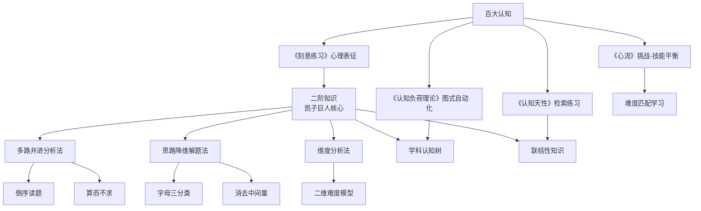

# MOC-B站分享拆解

> 38篇B站视频逐字稿的深度拆解，全部用百大认知书籍框架分析。
> 来源：`E:\ai产出文件\牛马\.shared\b站分享\`
> 拆解日期：2026-05-31

---

## 核心分析框架

- [[009-认知天性-Make-It-Stick]]：检索式练习、必要难度、流畅度错觉、间隔穿插
- [[017-刻意练习-Peak]]：心理表征、刻意vs天真练习、舒适区边缘、元认知
- [[025-认知负荷理论-Cognitive-Load-Theory]]：工作记忆4-7组块、图式自动化、已解答样例效应
- [[012-心流-Flow]]：挑战-技能平衡、清晰目标、即时反馈

---

## 凯子巨人系列（32篇）

### 方法论体系总览
- [[00-凯子巨人方法论体系总览]] — 二阶知识 × 三大方法论 × 执行工具

### 思路方法论（核心8篇）
- [[01-天才思考模式可习得]] — 二阶知识 vs 一阶知识
- [[02-为什么没有思路]] — 多路并进分析法雏形
- [[03-无序思考VS多路并进分析法]] — 答案过程≠思考过程
- [[04-多路并进分析法教程]] — 倒序读题+算而不求
- [[05-思路降维解题法]] — 字母三分类法
- [[06-理科强者下意识数学思路01]] — 从基础推导公式
- [[07-理科强者下意识数学思路02]] — 逐层简化法
- [[08-维度解题方法论]] — 维度作为通用思维工具

### 具体题型模块（10篇）
- [[09-函数烦恼基础版]]
- [[10-函数烦恼扩充版]]
- [[11-三角烦恼]]
- [[12-联结性知识vs知识碎片]]
- [[13-立体几何题型通法]]
- [[14-不等式放缩心路]]
- [[15-教材是最好的教辅-集合]]
- [[16-向量知识宏观理解]]
- [[17-多字母运算与方程思想]]
- [[18-建立学科认知树]]

### 刷题与学习系统（4篇）
- [[19-节约100小时刷题]]
- [[20-高三刷题详细流程]]
- [[21-学习的盲区]]
- [[22-不刷题不行只刷题更不行]]

### 高考实战（6篇）
- [[23-超前模拟运算]]
- [[24-最后的佛脚-压轴思维]]
- [[25-多路并进解最难新高考]]
- [[26-高考数学思路]]
- [[27-新高考反套路-书本知识加分解问题]]
- [[28-数学有多美-数学哲学]]

### 导数压轴与趋势（4篇）
- [[29-思路展开-导数压轴题]]
- [[30-最高屋建瓴导数题]]
- [[31-用数学分析新高考趋势]]
- [[32-为什么要学数学-文明皇冠]]

---

## AI与工具系列（6篇）

- [[天基大王-AI高效学习调研陌生领域]] — AI学习系统+知识地图
- [[小柳Salix-一人公司AI创业]] — 一人公司模式分析
- [[小橙子AI工作流-Obsidian同步FastNoteSync]] — Fast Note Sync插件
- [[星小脉-Obsidian改造成ClaudeCode指挥中心]] — Obsidian+AI集成
- [[枸杞加水-UPDF加Obsidian学习方法]] — AI时代学习方法
- [[阿超-B站收藏夹变AI知识库]] — 知识管理自动化

---

## 知识图谱：核心概念关联

---

## 小黎的迁移路径

### 电气/工程学习
- 多路并进分析法 → 电路分析题
- 思路降维解题法 → 电磁场推导
- 学科认知树 → 建立电气工程知识结构

### 考研备考
- 刷题系统设计 → 高效复习规划
- 超前模拟运算 → 难题突破策略
- 反套路应对 → 适应新题型

### AI工具
- AI学习系统 → Obsidian+Claude知识管理
- Fast Note Sync → 多设备同步方案
